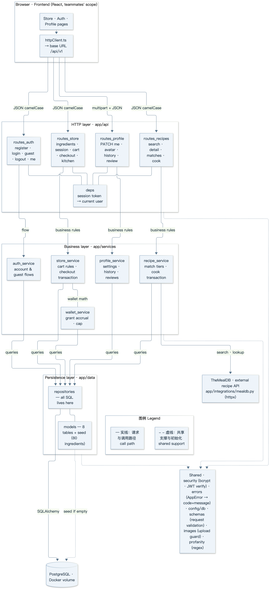
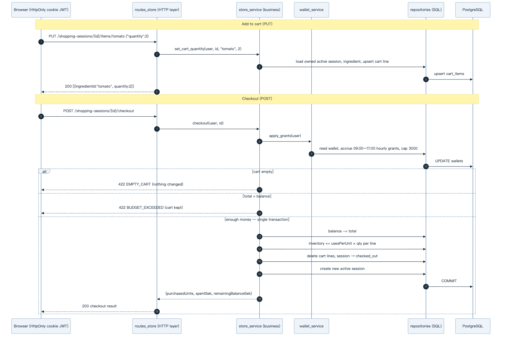
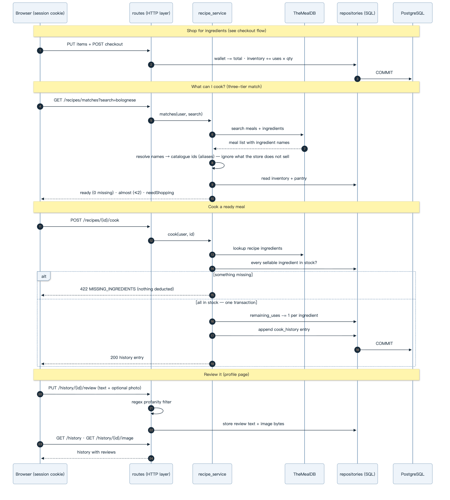

# Cart to Kitchen Backend — Architecture & Service Documentation

> Covers the backend as of this PR: auth, store/checkout with the wallet,
> kitchen, recipes with the three-tier match, cooking, and the profile page.
> The frontend still runs on its demo data until the wiring step.

## 1. Services currently provided

The backend exposes one HTTP service under `/api/v1` (port 8000), plus two
operational endpoints. All request/response bodies are JSON with camelCase
field names that mirror the frontend TypeScript types exactly, so the UI can
consume responses without a mapping layer.

| Method | Path | Purpose |
| --- | --- | --- |
| GET | `/healthz` | Liveness + database connectivity (ops) |
| GET | `/docs` | Interactive OpenAPI documentation (ops) |
| POST | `/api/v1/auth/register` | Create an account (email + password + display name) |
| POST | `/api/v1/auth/login` | Sign in, issues a session token |
| POST | `/api/v1/auth/guest` | Anonymous account for the frontend guest mode |
| POST | `/api/v1/auth/logout` | Clear the session cookie |
| GET | `/api/v1/auth/me` | Current user (requires auth) |
| GET | `/api/v1/ingredients` | Catalogue: 80 sellable items + the full TheMealDB pantry (~900, unlimited use) |
| GET | `/api/v1/shopping-sessions/active` | Wallet + cart + kitchen inventory snapshot (requires auth) |
| PUT | `/api/v1/shopping-sessions/{id}/items/{ingredientId}` | Set cart quantity, 0 removes (requires auth) |
| POST | `/api/v1/shopping-sessions/{id}/checkout` | Purchase the cart (requires auth) |
| GET | `/api/v1/kitchen/inventory` | Kitchen stock (requires auth) |
| GET | `/api/v1/recipes?search=` | TheMealDB recipe search |
| GET | `/api/v1/recipes/{id}` | Recipe detail: instructions + ingredients |
| GET | `/api/v1/recipes/matches?search=` | Three-tier match: ready / almost / needShopping (requires auth) |
| POST | `/api/v1/recipes/{id}/cook` | Consume ingredients, record history (requires auth) |
| PATCH | `/api/v1/me` | Change displayName / email / password (requires auth) |
| PUT/GET | `/api/v1/me/avatar` | Upload / fetch the avatar image (requires auth) |
| GET | `/api/v1/history` | Cooking history with reviews (requires auth) |
| PUT | `/api/v1/history/{id}/review` | Write a review: text + optional photo (requires auth) |
| GET | `/api/v1/history/{id}/image` | Fetch a review photo (requires auth) |

Errors are structured, never stack traces:

```json
{ "error": { "code": "rule_validation", "message": "There is not enough money in your wallet.", "details": { "code": "BUDGET_EXCEEDED" } } }
```

| code | HTTP | When |
| --- | --- | --- |
| `auth_required` | 401 | No session token sent |
| `invalid_credentials` | 401 | Wrong email/password at login |
| `invalid_session` | 401 | Token invalid or expired |
| `not_found` | 404 | Unknown ingredient/session; foreign sessions are hidden as 404 |
| `conflict` | 409 | Email already registered |
| `rule_validation` + `details.code` (`EMPTY_CART` / `BUDGET_EXCEEDED`) | 422 | Business rules rejected the checkout |
| `rule_validation` + `MISSING_INGREDIENTS` | 422 | Cooking without the required stock |
| `rule_validation` + `PROFANITY_REJECTED` | 422 | Review text hit the regex filter |
| `external_api_error` | 502 | TheMealDB unreachable |
| (FastAPI default) | 422 | Malformed request body / validation |

## 2. Configuration state

### 2.1 Runtime & deployment

One `docker compose up --build` starts the whole stack from `backend/compose.yaml`:

| Component | Image | Binding | Notes |
| --- | --- | --- | --- |
| API | built from `backend/Dockerfile` (python:3.12-slim) | `127.0.0.1:8000` → container 8000 | The exact base URL the frontend `.env.example` expects; healthcheck hits `/healthz` |
| Database | postgres:17-alpine | internal compose network only | Not published to the host; healthcheck `pg_isready`; data in named volume `ctk-postgres` |

The app bootstraps itself on startup: tables are created and the ingredient
catalogue is seeded (only if empty), so a fresh volume is immediately usable.
`docker compose down -v` resets all data.

### 2.2 Environment variables

| Variable | Default | Purpose |
| --- | --- | --- |
| `CTK_DATABASE_URL` | local PostgreSQL URL / compose built-in | SQLAlchemy connection string |
| `CTK_JWT_SECRET` | dev-only value | Session token signing key; must be replaced outside local development |
| `CTK_ALLOWED_ORIGINS` | Vite dev origins | CORS allow-list |
| `CTK_SESSION_HOURS` | 168 | Token lifetime in hours |
| `CTK_PG_PASSWORD` | ctk-local-only | Database password in compose |

Secrets come from the environment (12-factor) and are never committed;
documented in `backend/README.md`.

### 2.3 Database schema

Eight tables; every user-owned row is scoped by `user_id` / session ownership so
isolation is enforced in each query:

| Table | Purpose |
| --- | --- |
| `users` | Accounts and guest accounts (`mode`, nullable email/password for guests) |
| `ingredients` | Catalogue; `id` is the frontend slug (`tomato`) for the 80 sellable items, TheMealDB slugs for pantry; `uses_per_unit NULL` = infinite (pantry) |
| `shopping_sessions` | One active trip per user; `active` → `checked_out` rotation |
| `cart_items` | Session cart lines, unique (session, ingredient) |
| `inventory_items` | Kitchen stock: remaining uses per (user, ingredient) |
| `wallets` | One wallet per user: balance + accrual anchor |
| `cook_history` | One row per cooked meal; review text + optional photo bytes |
| `avatars` | At most one PNG/JPEG/WebP per user |

### 2.4 Business rules in force

| Rule | Value |
| --- | --- |
| Wallet starting balance | 500 SEK |
| Hourly grant | +100 SEK per full hour, 09:00–17:00 Europe/Stockholm |
| Wallet cap | 3000 SEK |
| Cart quantity cap | 9 per ingredient |
| Checkout failure modes | `EMPTY_CART` / `BUDGET_EXCEEDED` → 422, cart preserved |

Grants accrue lazily on every wallet read — no scheduler needed; a new wallet
anchored at today's 09:00 reproduces the frontend demo rule "500 + earned
today".

| Rule | Value |
| --- | --- |
| Match tiers | 0 missing → *ready*; ≤ 2 → *almost ready*; else *need shopping*; ingredients the store does not sell count as available |
| Cooking | every sellable ingredient must be in stock; each cook deducts one use and appends history (422 `MISSING_INGREDIENTS` otherwise, nothing deducted) |
| Reviews | regex profanity filter; images PNG/JPEG/WebP ≤ 2 MB (shared guard with the avatar) |

## 3. Testing

**Postman — the HTTP test suite** (`backend/postman/`, 25 ordered requests:
auth → store/checkout → recipes/match/cook → kitchen → profile/avatar/review),
verified green with newman. Assertions target the four must-test classes:
auth boundaries (401), business error codes, money & inventory math, and
contract-critical fields. Scheduled runs with failure notifications: a
Postman Monitor on the collection (e.g. every 10 minutes), or newman in CI.

```bash
cd backend && docker compose up -d
npx newman run postman/cart-to-kitchen.postman_collection.json \
  -e postman/local.postman_environment.json
```

**pytest — pure-function tests only** (wallet grant math, match tier
boundaries, the review profanity regex): edge cases that cannot be reached
through live HTTP because the clock or inventory state is not controllable.

```bash
pip install -e ".[dev]" && pytest
```

## 4. Architecture



Layered architecture, exactly the shape the TA recommended (Controller →
Service → Repository/Model) — and the property he explicitly grades on:
concerns do not mix. The rules that keep it that way:

- **`app/api/` (HTTP layer)** — routers and dependencies only: parse requests,
  call one service function, shape the response. No SQL, no business rules.
- **`app/services/` (business layer)** — all rules live here: auth flows,
  wallet grant math, checkout transaction. Knows nothing about HTTP (raises
  `AppError` subclasses, never returns status codes).
- **`app/data/` (persistence layer)** — repositories contain every SQL query;
  models define the eight tables; `seed.py` is generated from the frontend
  `dummyData.ts` (regenerate, don't hand-edit, so the two never drift).
- **`app/integrations/`** — the TheMealDB client (`httpx`), no caching or
  retries: failures map to 502.
- **Cross-cutting** — `security.py` (bcrypt, JWT sign/verify), `errors.py`
  (uniform error JSON), `config.py`/`db.py` (settings, engine, bootstrap),
  `schemas.py` (request validation only; responses are plain camelCase dicts
  built by the services), `images.py` (shared upload guard), `profanity.py`
  (regex filter).

Request path: browser → router (`app/api`) → service (`app/services`) →
repository (`app/data`) → PostgreSQL. Responses bubble back the same way;
business failures become structured errors at the HTTP boundary.

## 5. Data flow

### 5.1 Checkout 资金路径



### 5.2 The cook loop 做饭闭环



**EN.** Shopping feeds the inventory; the match resolves recipe ingredient
names to catalogue items through aliases (names the store does not sell count
as available) and buckets meals into ready / almost / needShopping; cooking is
one transaction that verifies stock, deducts one use per ingredient and
appends history; reviews attach text (regex-filtered) and an optional photo
from the profile page.

The diagram traces the money-critical path — checkout — end to end:

1. **Cart writes** go through ownership checks (foreign or retired sessions
   read as 404, so ids don't leak); quantity clamped to 0–9.
2. **Every snapshot read** first accrues wallet grants (lazy accrual — the
   09:00–17:00 Stockholm window, 100 SEK/full hour, cap 3000).
3. **Checkout** is one transaction: empty-cart and budget validation (422,
   cart preserved on failure) → deduct wallet → add inventory uses (pantry
   items skipped) → clear cart → retire the session → open the next active
   session.

## 6. Authentication & security

Sessions are JWTs (HS256) that the **server always verifies** — signature and
expiry checked on every request, which is precisely the grading criterion
("server must verify tokens, not just receive them"; the TA's feedback warned
that students who bolt JWT on at the last second lose these points). Transport:
HttpOnly `ctk_session` cookie for browsers, `Authorization: Bearer` for API
clients. Passwords are bcrypt-hashed; guest accounts have nullable credentials.
Known minimum-version limitation: logout clears the cookie but cannot revoke
an already-issued stateless token server-side — acceptable for the course
scope, documented deliberately.

## 7. What remains

Only the frontend wiring: switching the `*.api.ts` files from the in-memory
demo data to `httpClient` (a frontend change, coordinated with Emma and
Jamie). The backend now serves every feature the UI has — auth, store,
kitchen, recipes/match/cook, profile, history and reviews.

---

*Diagrams are rendered from Mermaid; ask in the team channel for the sources
if you want to edit them.*
